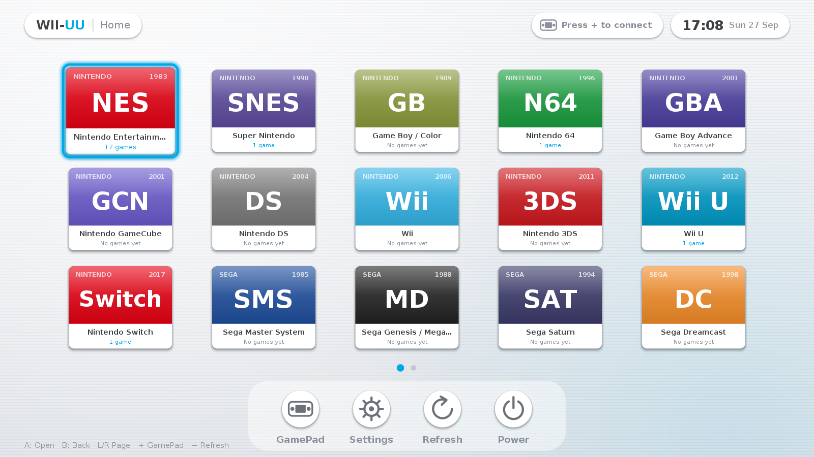
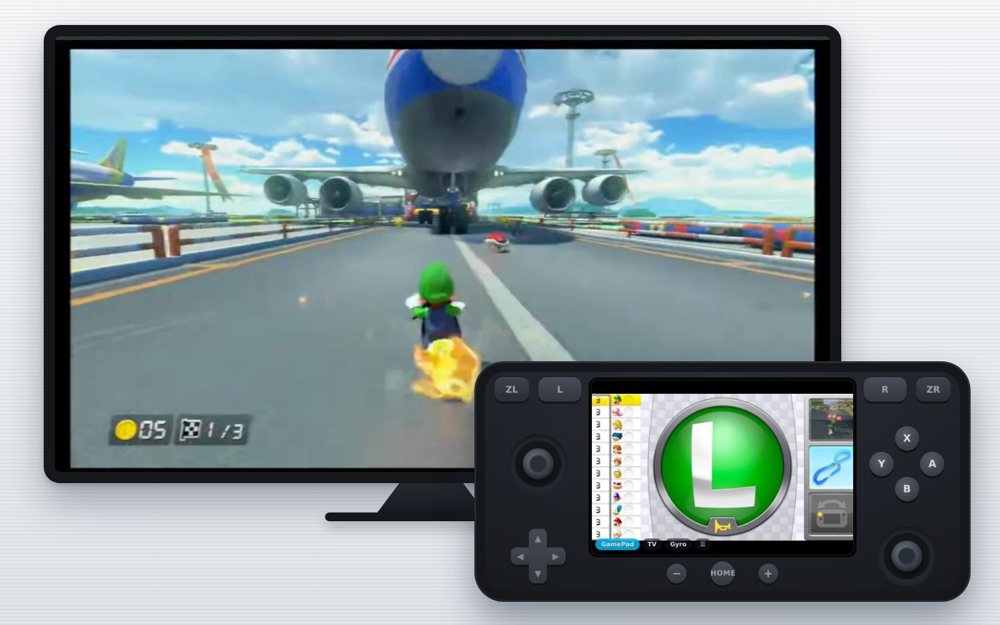
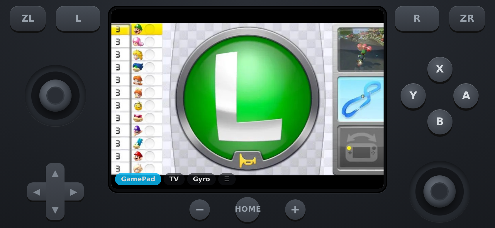

# WII-UU

A Wii U Menu–style emulator frontend written in Java, with a built-in web server that turns
any phone into a Wii U–like GamePad. The GamePad has buttons and sticks, a live touch screen
(Wii U GamePad view, DS/3DS bottom screen, or the whole TV), gyro, and the PC's sound. There are
no dependencies beyond Java 17+.

Website: **https://wiiuu.stoppedwumm.net** (served from `docs/`). It has a one-line install for
Linux, Raspberry Pi and macOS: `curl -fsSL https://wiiuu.stoppedwumm.net/get.sh | bash`.




It covers consoles from the NES to the Wii U and Switch, and Sony up to the PS4:

| Nintendo | Sega | Sony |
|---|---|---|
| NES, SNES, Game Boy/Color, N64, GBA, GameCube, DS, Wii, 3DS, **Wii U**, **Switch** | Master System, Genesis/Mega Drive, Saturn, Dreamcast | PS1, PS2, PSP, PS3, **PS4** |

WII-UU is a **launcher**: it finds your games, shows them in the Wii U–style UI and starts
the right emulator for each one. Each emulator (Mesen, Snes9x, Mupen64Plus, Dolphin, Cemu,
Ryujinx, DuckStation, PCSX2, PPSSPP, RPCS3, shadPS4 …) is installed separately. You also need
your own legally dumped games and, where an emulator requires it, your own firmware or keys.

## Install

Download [`WII-UU-latest.zip`](https://wiiuu.stoppedwumm.net/download/WII-UU-latest.zip), unzip
it, then:

* **Linux / macOS:** `./install.sh`
  (on Linux, `./install.sh --with-emulators` also installs the emulators, from official releases or source, and
  configures them for you; see below.)
* **Windows:** double-click `install.bat`

The installer:

* checks for Java 17+ and offers to install it (apt, dnf, pacman, zypper, Homebrew or winget)
* installs the app and adds a `wiiuu` command plus a menu, Start-menu or Desktop shortcut
* creates `~/WiiUU/roms/<system>` folders
* on Windows it adds a firewall rule when run as administrator; on Linux it prints the `ufw` or
  `firewalld` command to run
* **Linux:** offers the GamePad extras: `ffmpeg` (screen), `x11-utils` (finding windows), `python3`
  and `uinput` (virtual controllers), and `pulseaudio-utils` (sound)
* **macOS:** builds a native `WII-UU.app`, and offers Apple's Command Line Tools. WII-UU needs
  them to compile its screen and sound helpers.

To uninstall, run `./install.sh --uninstall` or `install.ps1 -Uninstall`. Your ROMs and settings are kept.

## Console Mode (Linux, Raspberry Pi)

Console Mode turns a PC or Raspberry Pi into a WII-UU console, the way SteamOS does on a Steam
Deck. The computer boots straight into WII-UU, full screen, with no desktop around it.

```sh
curl -fsSL https://wiiuu.stoppedwumm.net/get.sh | bash -s -- --console-mode   # new install
sudo wiiuu-console install                                                    # WII-UU already installed
```

* **Power → Desktop Mode** logs you into your normal desktop. The **Return to WII-UU** icon on the
  desktop, or in the app menu, goes back.
* **Power** also offers Restart and Shut Down, so a keyboard is never needed.
* **Every boot** starts in console mode again, like on a Steam Deck.
* **If WII-UU crashes,** it is started again. If it fails three times in a row, the computer switches
  to the desktop, so you can never get locked out.
* **Updates** from *Settings → Check for updates* install in place, and WII-UU comes back by itself.

How it works:
* A login session called *WII-UU (Console Mode)* runs `wiiuu-session`, which keeps WII-UU running
  full screen under a minimal Openbox window manager. It also hides the mouse pointer and keeps the
  TV from blanking.
* The display manager logs you in automatically, to that session or to the desktop. LightDM (as on
  Raspberry Pi OS), SDDM (KDE) and GDM (GNOME) are supported. The installer adds LightDM if none is
  installed.
* The installer adds Xorg, Openbox and unclutter if they are missing.
* Switching uses a sudo rule that allows only `wiiuu-console switch desktop|console`.

```sh
wiiuu-console status                 # what's set up
wiiuu-console switch desktop         # switch now (the current session ends)
sudo wiiuu-console install --desktop plasma   # pick which desktop Desktop Mode opens
sudo wiiuu-console uninstall         # back to a normal desktop login
```

The session's log is in `$XDG_RUNTIME_DIR/wiiuu-session.log`.

## Installing emulators (Linux, Raspberry Pi)

`emulators.sh` (installed as `wiiuu-emulators`) sets up the emulators and points WII-UU's system
commands at them. It doesn't use Flatpak or containers.

* **Official releases first:** for each emulator it downloads the newest prebuilt Linux release
  for your CPU (x86-64 or 64-bit ARM such as a Raspberry Pi 4/5) from the project's GitHub or
  GitLab releases. The right file is chosen by name at install time, so new versions are picked
  up automatically. AppImages are unpacked, so they run without FUSE.
* **Source as fallback:** if a project publishes no Linux build for your CPU (for example
  Dolphin, or most ARM builds), the script compiles its latest source instead.

```sh
wiiuu-emulators              # releases where available; builds the light rest from source
wiiuu-emulators --all        # also build heavy emulators that have no release (e.g. Dolphin)
wiiuu-emulators --only ppsspp,duckstation
wiiuu-emulators --update     # update everything installed; skips what is already newest
wiiuu-emulators --list       # what is available / installed on this machine
wiiuu-emulators --nightly    # allow pre-release / rolling builds
wiiuu-emulators --source     # always build from source (bleeding edge)
wiiuu-emulators --releases-only
```

* **Emulators:**
  * With official releases: DuckStation, RPCS3, Ryujinx, Cemu, Azahar, melonDS, PPSSPP, Flycast,
    mGBA, Snes9x, FCEUX, and on x86-64 also PCSX2 and shadPS4. Whether an ARM64 build exists is
    up to each project.
  * Always built from source: Mupen64Plus, Mednafen and Dolphin, which publish no Linux binaries.
* **Build details:** source builds install their apt dependencies only when needed, and pick the
  number of parallel jobs from your RAM. Heavy builds can take hours on a Pi and need about 4 GB
  of swap on boards with under 6 GB of RAM.
* **Logs and files:** logs go to `~/.wiiuu/logs/build/<name>.log`. Emulators are kept in
  `~/.local/share/wiiuu-emulators`, and uninstalling WII-UU keeps them.
* **Rate limit:** GitHub allows 60 anonymous API requests per hour. Set `GITHUB_TOKEN` if you hit it.
* **Not supported:** PCSX2 (PS2) and shadPS4 (PS4) only run on x86-64.

## Use

1. Copy games into `~/WiiUU/roms/<system>/`. The folder names are `nes snes gb n64 gba gc nds wii 3ds wiiu
   switch sms genesis saturn dc ps1 ps2 psp ps3 ps4`.
   * PS3 and PS4 games are folders. WII-UU finds the `EBOOT.BIN`/`eboot.bin` inside each one.
   * Wii U: `.wua`, `.wud`, `.wux`, or the `code/*.rpx` of an unpacked game.
   * Covers: put `covers/<game name>.png` (or `.jpg`) in a system folder, or place the image next to the ROM
     with the same name. PS3 `ICON0.PNG` and PS4 `sce_sys/icon0.png` are used automatically.
2. Start WII-UU and press **F1** (Settings). Check each system's emulator command, or use
   *Emulator program…* to pick the executable. In a command, `{rom}` is the game file, `{dir}`
   is its folder and `{name}` is its title.
3. Choose a system, then a game, and press Enter or A.

| Keyboard | GamePad | Action |
|---|---|---|
| Arrows / WASD | D-pad / left stick | Move |
| Enter / Space | A | Open / play |
| Esc / Backspace | B | Back |
| PgUp / PgDn, Q / E | L / R, ZL / ZR | Change page |
| F2 | + | Show the GamePad QR code |
| F5 | − | Rescan games |
| F1 | – | Settings |
| F11 | – | Toggle fullscreen |
| Ctrl+Q | HOME → Close game | Quit the running game |

**Start-up and music.** WII-UU opens with a short start-up animation and chime. Any key, click or
GamePad button skips it. The menu then plays relaxed background music, an original jazzy loop
that WII-UU synthesizes itself, so no audio files ship. The music fades out while a game runs and
comes back afterwards. Both can be turned off under *Settings → General* (`ui.bootAnimation`,
`ui.music`), and `ui.musicVolume` (0–100, default 45) sets the level.

**Dark mode.** *Settings → General → Theme* offers Auto, Light or Dark (`ui.theme`). *Auto*
follows the system's appearance on macOS, Windows and GNOME/KDE, and switches along when you
change it.

## RetroArch mode

Turn on *Settings → General → RetroArch mode* (`retroarch.enabled=true`) to run every system that has
a libretro core in [RetroArch](https://www.retroarch.com) instead of its standalone emulator.

| System | Cores, best first |
|---|---|
| NES | Mesen, Nestopia, FCEUmm, QuickNES |
| SNES | Snes9x, bsnes |
| Game Boy / Color | SameBoy, Gambatte, mGBA |
| GBA | mGBA, VBA Next, gpSP |
| N64 | Mupen64Plus-Next, ParaLLEl N64 |
| GameCube / Wii | Dolphin |
| DS | melonDS DS, melonDS, DeSmuME |
| 3DS | Citra |
| Master System / Genesis | Genesis Plus GX, PicoDrive |
| Saturn | Beetle Saturn, YabaSanshiro, Kronos |
| Dreamcast | Flycast |
| PS1 | SwanStation, Beetle PSX HW, PCSX ReARMed |
| PS2 | LRPS2 (PCSX2) |
| PSP | PPSSPP |

Wii U, Switch, PS3 and PS4 have no cores, so they keep their standalone emulators.

* **Finding RetroArch:** WII-UU looks in `/Applications/RetroArch.app` on macOS, on the `PATH`, in
  Flatpak (`org.libretro.RetroArch`) and in `C:\RetroArch-Win64`. Set `retroarch.path` if yours is
  elsewhere.
* **Cores:** WII-UU uses the best core it finds in RetroArch's core folder or your distribution's
  libretro packages. If none is installed, it downloads one from the libretro buildbot on first
  launch, then starts the game by itself.
  * If that fails, it falls back to the standalone emulator.
  * `retroarch.core.<system>=snes9x` (or a path) picks a core.
  * `retroarch.download=false` turns downloads off.
  * `system.<id>.retroarch=false` keeps one system on its standalone emulator.
* **Controls:** RetroArch gets WII-UU's own key layout for players 1–4, and on Linux it sees the
  virtual Xbox pads.
  * Its keyboard shortcuts (reset, fast-forward, full screen…) only work while **right Ctrl** is held,
    so stick keys can't trigger them. Change the key with `retroarch.hotkeyEnable`.
  * These settings are in `~/.wiiuu/retroarch.cfg`. RetroArch loads that file on top of its own
    settings, only for games WII-UU starts.
* **BIOS:** some cores need BIOS files in RetroArch's `system` folder, as the core's documentation
  says: PS1 (SwanStation can run without), PS2, Saturn and, optionally, Dreamcast.

## Phone as GamePad

Press **+** or **F2** on the TV and scan the QR code. You can also open the URL shown there on a phone
connected to the same Wi-Fi and enter the 4-digit pairing code.

The page is laid out like a Wii U GamePad. It has two analog sticks (tap a stick for L3 or R3),
a D-pad with diagonals, ABXY, L/R/ZL/ZR, −, HOME and +. You can slide a finger from one button
to another. It vibrates on each press, keeps the screen awake, and can go fullscreen or be added
to the home screen.

The GamePad's screen shows your library, and tapping a game starts it on the TV. While a game
runs, it shows *Now Playing*, and HOME opens a menu with *Close game*. Up to 4 phones can connect,
and each one is assigned a player number (P1–P4).

**Phones stay paired.** The pairing code is created once and kept, and every paired phone keeps
its player number in `~/.wiiuu/pads.properties`. When WII-UU restarts, phones reconnect on their
own. To unpair all phones, change the code under *Settings → General*.

### 8 players and Buzz! mode

* **8-player mode:** *Settings → General → 8-player mode* (`server.maxPlayers=8`) lets up to 8 phones
  play at once, as players 1–8.
  * On Linux, each phone is its own virtual controller.
  * DSU motion and touch are limited to players 1–4 by the protocol.
  * With the keyboard fallback, players 3–8 have no default keys. Set them under *Settings → GamePad
    Keys*.
* **Buzz! mode:** in PS2 Buzz! quiz games, every phone turns into a Buzz! buzzer: a big red button
  and the four coloured answer buttons.
  * It switches on by itself for PS2 games with "Buzz" in the name (`buzz.games` is a regex), and
    `buzz.enabled=false` turns it off.
  * While the game runs, PCSX2 gets its emulated Buzz! controllers: four buzzers on USB port 1
    (players 1–4) and, in 8-player mode, four more on port 2 (players 5–8).
  * Each buzzer is bound to its own keys, and the pads' keyboard keys are cleared for the game, so a
    buzzer can't press a pad button.
  * Your own PCSX2 settings come back afterwards, line by line, as with the pad mapping.
  * HOME or *GamePad* on the phone shows the normal GamePad again.

| Player | Red | Blue | Orange | Green | Yellow |
|---|---|---|---|---|---|
| 1 | 1 | 2 | 3 | 4 | 5 |
| 2 | 6 | 7 | 8 | 9 | 0 |
| 3 | Q | W | E | R | T |
| 4 | Y | U | I | O | P |
| 5 | A | S | D | F | G |
| 6 | H | J | K | L | Z |
| 7 | X | C | V | B | N |
| 8 | M | Home | End | Page Up | Page Down |

### How input reaches emulators

* **Linux (including Raspberry Pi): real controllers.** Each phone becomes a virtual **Xbox 360
  controller** through the kernel's `uinput`. Emulators detect it like a USB pad, with analog
  sticks, analog triggers and all buttons, and it works whichever window has focus. Buttons are
  mapped by position (Nintendo A = right, B = bottom). `install.sh` enables this: it loads
  `uinput` and adds a udev rule. It needs `python3`.
* **Fallback: keyboard keys (macOS, Windows).** Without virtual controllers, WII-UU types keys
  into the focused emulator window.
  * **Player 1:** gets each emulator's own default keyboard layout, so nothing needs mapping for
    Dolphin (GameCube), PPSSPP, mGBA, melonDS, DuckStation, Ryujinx and Azahar.
  * **Other emulators and players 2–4:** use the layout under *Settings → GamePad Keys*, which
    follows RetroArch. Keys you set there always win.
  * **Adjusting one emulator's layout:** use `keys.<emulator>.<BUTTON>=KEY`, for example
    `keys.dolphin.ZL=A`.
  * `input.keys=on` forces keys even when virtual controllers work.

| Button | P1 key | P2 key |
|---|---|---|
| D-pad | Arrow keys | 8 / 5 / 4 / 6 |
| A B X Y | X Z S A | 3 2 9 1 |
| L R ZL ZR | Q W E R | 7 0 O P |
| + / − | Enter / Shift | N / M |
| Left stick | T F G H | 8 5 4 6 |
| Right stick | I J K L | – |
| L3 / R3 | C / V | B / Y |

Notes on the keyboard fallback:

* **Linux Wayland:** keys reach X11/XWayland windows. Most emulators accept them, and Qt apps
  can be forced with `QT_QPA_PLATFORM=xcb`.
* **macOS:** allow WII-UU under *Privacy & Security → Accessibility* (see macOS setup). Dolphin
  gets a temporary mapping of its own.

## The GamePad screen: Wii U, DS and 3DS

As on a real Wii U, the phone's screen shows a picture from the PC and you can touch it.


The picture is streamed at 30 fps.

* **Linux and Windows:** with **ffmpeg** installed (the installers offer it), capture and encoding
  are fast enough for a Raspberry Pi.
* **macOS:** uses **ScreenCaptureKit** through a small Swift helper (`resources/mac/capture.swift`).
  The GPU crops and scales the picture, and macOS encodes it. WII-UU compiles the helper itself
  on first start with the Xcode Command Line Tools (`xcode-select --install`; Homebrew already
  installs them). Until the helper is ready, or if it fails, slower Java capture is used. It needs
  *Screen Recording* (see macOS setup). If something fails, the reason is in
  `~/.wiiuu/logs/capture.log` (building: `capture-build.log`).
* **TV mode during a game** streams only the emulator's window, not the whole desktop.
  `stream.tvFollowsGame=false` mirrors the whole screen instead.
* **If ffmpeg fails:** WII-UU switches to Java capture on its own.
* **On the phone:** the page fetches one frame at a time and asks for the next as soon as the
  last one has arrived. Frames can't pile up in the network, so the picture is always the newest
  one, and a slow phone or Wi-Fi drops frames instead of falling behind. Browsers that can't do
  this fall back to a plain MJPEG stream.

* **GamePad / Touch screen:** when a game with a second screen starts, the phone switches to it
  automatically, and a tap becomes a mouse click at that spot. Emulators read those clicks as
  touch input.
  * **Wii U (Cemu):** turn on *View → Separate GamePad view* in Cemu. The phone then shows the
    "GamePad View" window.
  * **DS (melonDS):** the phone shows the bottom screen. Use melonDS's default vertical layout.
  * **3DS (Azahar):** the phone shows the bottom screen. Use the default layout.
* **TV:** mirrors the whole screen, including the WII-UU menu (Off-TV play).
* **Gyro (motion controls):** tap *Gyro* on the phone. Phones only share motion sensors with
  secure pages, so WII-UU also serves `https://<pc>:8443/`. The phone offers this link, and you
  accept its self-signed certificate once.

### Sound on the phone

Tap **🔇 Sound** on the phone to hear the PC's sound there as well. Phones only play sound after a
tap, so after reloading the page the first tap turns it back on. The phone keeps about 0.1 s of
sound buffered, so the sound runs slightly behind the picture.

* **macOS 13 or newer:** a second small ScreenCaptureKit helper (`resources/mac/audio.swift`)
  records the sound. It is compiled on first start like the picture helper, but kept separate, so
  a problem with sound never affects the picture. It uses the same *Screen Recording*
  permission. The Mac keeps playing the sound too.
* **Linux:** records the default output's monitor with `parec`, from `pulseaudio-utils`
  (PulseAudio or PipeWire), or with ffmpeg.
* **Windows:** needs ffmpeg and a loopback recording device. Turn on *Stereo Mix* under Sound
  settings → Recording, or install a virtual cable. Set `audio.device` to pick a device by name.
* **iPhone:** with the silent switch on, only iOS 17 and newer play the sound.
* **If there's no sound:** the phone shows why, and details are in `~/.wiiuu/logs/audio.log`
  (macOS helper build: `audio-build.log`).
  `audio.enabled=false` turns sound off, and `audio.command` replaces the recorder. The command
  must write raw 48 kHz 16-bit stereo PCM to its output.

### Real controller input with DSU

The phone also appears as a DSU ("cemuhook") controller at `127.0.0.1:26760`, one slot per player.
Unlike the keyboard keys, this gives real **analog sticks**, **gyro/accelerometer** and **touch**.
Set it up once in each emulator:

| Emulator | Where to set it up |
|---|---|
| Cemu (Wii U) | Input settings: emulated controller *Wii U GamePad*, API *DSUController*, 127.0.0.1 : 26760. Map the buttons and enable motion. |
| Dolphin (GC/Wii) | Controller settings → Alternate input sources → DSU Client → add 127.0.0.1 : 26760. |
| Azahar (3DS) | Controls → Motion / Touch → *CemuhookUDP*, 127.0.0.1 : 26760. |
| Ryujinx (Switch) | Input → Motion → CemuHook compatible motion, 127.0.0.1 : 26760. |

On Linux the virtual controllers already cover buttons and sticks, so use DSU mainly for motion
and touch. If you use DSU instead of the virtual controller on another OS, set
`system.<id>.keys=false` (for example `system.wiiu.keys=false`) so WII-UU stops typing keys into it. If motion feels inverted in an
emulator, flip axes with `dsu.motionSigns`: accel x y z, then gyro pitch yaw roll, e.g. `+-+ +++`.

Screen streaming and touch use X11/XWayland windows on Linux (install `x11-utils`), user32 on
Windows, and Accessibility / Screen Recording permissions on macOS.

## macOS setup

macOS blocks two things until you allow them. Until then the GamePad screen comes back **black**
and the GamePad buttons don't reach emulators. `install.sh` builds a native `WII-UU.app`
(`~/Applications`, using the JDK's `jpackage`) so these permissions have an app to belong to:

1. Start WII-UU from **~/Applications/WII-UU.app**, not from a terminal.
2. In *System Settings → Privacy & Security*, turn on **WII-UU** under **Screen Recording** and
   **Accessibility**. *Settings (F1) → General → macOS permissions* opens both pages.
3. Restart WII-UU.

If the picture is black, the phone and the TV now say so instead of showing a black screen.

**Dolphin:** there are no virtual controllers on macOS. So while a GameCube or Wii game runs,
WII-UU temporarily gives Dolphin a keyboard mapping that matches exactly what the phone sends:
* **GameCube:** a standard controller in port 1.
* **Wii:** a Wii Remote with Nunchuk. The pointer follows the mouse, which tapping on the phone's
  TV mirror moves.

Your own Dolphin controller settings are backed up and restored when the game ends, or at the
next start if WII-UU was killed. Turn this off with `input.dolphinMapping=off`.

**PCSX2 (PS2) and DuckStation (PS1):** the same idea, on every system where WII-UU types keys
(macOS, Windows, and Linux without virtual controllers).
* While a game runs, controller ports 1 and 2 are bound to exactly the keys the phones send.
* Only those binding lines are changed. Their original values are kept in
  `PCSX2.ini.wiiuu-keys` / `settings.ini.wiiuu-keys` and put back when the game ends, or at the next
  start if WII-UU was killed. Settings you change in the emulator during the game stay.
* The emulator's settings file is used once it exists, so start PCSX2 or DuckStation once on its own
  first (for PCSX2's BIOS setup).
* `input.emulatorMapping=off` turns this off. `input.pcsx2.settings` / `input.duckstation.settings`
  point to a settings file in another place.

## Updating

* **In the app:** *Settings (F1) → General → Check for updates*. WII-UU also checks once at each
  start and shows a notification when a new version is out.
* **In a terminal:** `wiiuu --upgrade`, or `curl -fsSL https://wiiuu.stoppedwumm.net/get.sh | bash`.

An update downloads the new release, verifies its SHA-256 checksum, and runs its installer.
Settings, ROMs, paired phones and emulators are kept, and WII-UU restarts. To update the
emulators, run `wiiuu-emulators --update`.

## Troubleshooting

* **An emulator doesn't start:**
  * If the configured program isn't installed, WII-UU looks for the emulator under other
    names, in `wiiuu-emulators`, in Flatpak and in `~/Applications/*.AppImage`.
  * If none is found, the notification says so. Dolphin, for example, has no Linux release, so
    install it with `wiiuu-emulators --only dolphin` (a source build).
  * If the emulator crashes at start, the notification shows the last line of
    `~/.wiiuu/logs/<system>.log`.
* **A game doesn't close:** *Close game* (HOME on the phone, or Ctrl+Q) asks the emulator to quit,
  and force-kills it if it's still running after 3 seconds. That includes emulators waiting on a
  "stop emulation?" dialog.
  * **Linux:** the whole process group is stopped, and Flatpak apps with `flatpak kill`.
  * **macOS:** apps started with `open -a App` receive Quit, then their process is stopped by its
    path inside the `.app` bundle.
* **Choppy GamePad screen:**
  * **Linux/Windows:** install `ffmpeg`. The phone mentions it when it isn't installed.
  * **macOS:** make sure the terminal shows `GamePad streaming via ScreenCaptureKit`. If it
    doesn't, install the Command Line Tools and check `capture-build.log`.
  * **Slow Wi-Fi:** lower `stream.maxWidth` or `stream.quality`.
* **Delayed GamePad screen:** the phone fetches one picture at a time, so delay can't build up in the
  network. What's left comes from Wi-Fi and the frame rate:
  * Use 5 GHz Wi-Fi, or put the PC on a cable.
  * Try `stream.fps=60` for less delay, if the Wi-Fi keeps up.
* **No sound on the phone:** tap *Sound*. The phone says why if the PC can't record, and
  [Sound on the phone](#sound-on-the-phone) lists what each OS needs.

## Settings file

Settings are stored in `~/.wiiuu/config.properties`. You can move this folder with `WIIUU_HOME` or `--home`.
Useful keys:

```properties
roms.base=/home/me/WiiUU/roms
system.wiiu.command="/opt/Cemu/Cemu" -f -g {rom}
system.ps2.romdir=/mnt/games/ps2
system.sms.hidden=true
server.port=8080
server.requireCode=true
server.code=1234            # pairing code (created once and kept; change it to unpair phones)
server.https=true           # secure address for gyro (server.httpsPort=8443)
stream.fps=30               # GamePad screen: stream.maxWidth=854, stream.quality=60, stream.backend=auto|ffmpeg|java
audio.enabled=true          # sound on the phone; audio.device=<name>, audio.command=<recorder writing s16le 48 kHz stereo>
input.keys=auto             # type keys too? auto = only without virtual controllers | on | off
update.check=true           # look for a new version at start
screen.nds.region=0,0.5,1,0.5   # second screen: screen.<id>.window / .aspect / .region
dsu.port=26760              # DSU controller server (dsu.enabled, dsu.motionSigns)
keys.p1.A=X
ui.fullscreen=true
ui.minimizeOnLaunch=true
ui.music=true               # background music in the menu; ui.musicVolume=45 (0-100)
ui.bootAnimation=true       # start-up animation and chime
ui.theme=auto               # auto (follow the system) | light | dark
retroarch.enabled=false     # RetroArch mode; retroarch.path, retroarch.core.<id>, retroarch.download
```

Command line: `wiiuu [--fullscreen|--windowed] [--port N] [--no-server] [--home DIR] [--check-update|--upgrade]`

## Trailer

`trailer/` holds the trailer shown on the website: a keynote-style page (`trailer.html`, which
also plays live in a browser), rendered frame by frame. The soundtrack is WII-UU's own boot chime
and menu music. `trailer/render.sh` takes fresh screenshots, renders the soundtrack and writes
`dist/WII-UU-trailer.mp4` and `docs/trailer.mp4`. It needs Node with Playwright, and ffmpeg.

`trailer/render2.sh` makes the second trailer, a narrated demo (`dist/WII-UU-demo-trailer.mp4`,
`docs/trailer-demo.mp4`):
* `demo.mjs` records the real WII-UU on a virtual 1080p TV (Xvfb) while a phone-sized browser uses
  its GamePad page.
* `voice.py` speaks the narration from `trailer2.html` with the Kokoro voice model (Apache-2.0),
  which sherpa-onnx runs offline. The script downloads the model the first time.
* `trailer2.html` puts the demo, the phone and subtitles together with scenes from the first trailer.

`trailer/render-youtube.sh` makes the YouTube video: a narrated overview with chapters, about 2½
minutes (`dist/WII-UU-youtube.mp4`). The script is in `youtube.json`, and each section is as long
as its narration. It also writes captions (`.srt`), the chapter timestamps, a thumbnail
(`thumbnail.html`) and a description ready to paste.
* The default voice is the offline Kokoro one.
* `VOICE_ENGINE=elevenlabs ELEVENLABS=<key> ./trailer/render-youtube.sh` uses ElevenLabs instead.
  `VOICE_ID` picks the voice.

## Presentation

`presentation/` holds an 8-minute narrated presentation about WII-UU: what it does, how it works
under the hood, and how to set it up. The slides are styled after the Wii U menu, with a pinstriped
light background, white cards and pages that glide sideways.
* The script and slides are in `talk.json`, one entry per slide, with its narration.
* Every point on a slide appears when the narration reaches it, and each slide is as long as its
  narration.
* `presentation/render.sh` renders `dist/WII-UU-presentation.mp4`, with captions and chapter
  timestamps.
* `VOICE_ENGINE=elevenlabs ELEVENLABS=<key>` uses an ElevenLabs voice instead of the offline one.

## Build from source

```sh
./build.sh      # -> build/wiiuu.jar   (JDK 17+)
./package.sh    # -> dist/WII-UU-<version>.zip
java -jar build/wiiuu.jar
```

GitHub Actions (`.github/workflows/build.yml`) builds and smoke-tests every push, and keeps the
zip as an artifact of the run. Each push to the default branch also publishes the website:
* The build puts the new zip into `docs/download/` and writes a matching `version.json`, then deploys
  `docs/` to GitHub Pages. The website and *Check for updates* always offer the newest build, with
  no committed zips needed.
* For this to work, set *Settings → Pages → Source* to **GitHub Actions**.
* A `v*` tag also creates a GitHub release with the zip.

The code is in `src/wiiuu`:

* `core`: system catalogue, ROM scanner, config and emulator launcher
* `ui`: the Wii U–style Swing menu and the settings dialog
* `net`: the GamePad HTTP server (`com.sun.net.httpserver`) and a small QR encoder
* `input`: routes GamePad input to menu navigation, or to key presses via `java.awt.Robot`

The phone page is `resources/web/pad.html`.
